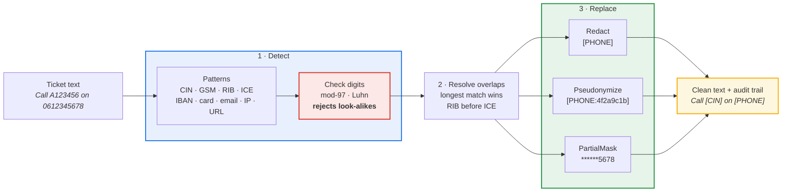

<div align="center">

# glpi-anonymizer

**Strip personal data out of GLPI ticket exports — with real Moroccan identifiers (CIN, RIB, ICE, GSM) and check-digit validation.**

[](https://github.com/novagiosAI/glpi-anonymizer/actions/workflows/ci.yml)
[](https://pypi.org/project/glpi-anonymizer/)
[](https://pypi.org/project/glpi-anonymizer/)
[](LICENSE)
[](https://peps.python.org/pep-0561/)

*No dependencies. Nothing leaves your machine.*

</div>

---

## The problem

You want to analyse your helpdesk tickets — train a classifier, measure
resolution times, share a sample with a vendor. The tickets are full of phone
numbers, ID card numbers and bank details typed in by users, so you cannot.

Generic PII tools know about US Social Security numbers and miss a Moroccan
CIN entirely. Tools that do match local formats tend to match *too much*: any
24-digit string becomes a "bank account", and your asset tags get shredded.

## The approach: validate, don't just match

Every identifier that carries a check digit is verified before it is treated as
personal data:

| Identifier | Shape | Validated |
|---|---|---|
| **RIB** (Moroccan bank account) | 24 digits | ✅ mod-97 check key |
| **IBAN** | `MA` + 26 chars | ✅ ISO 7064 MOD-97-10 |
| **Card number** | 12–19 digits | ✅ Luhn |
| **ICE** (company id) | 15 digits | pattern |
| **CIN** (national ID) | 1–2 letters + 5–6 digits | pattern |
| **GSM / landline** | `+212` / `0` + 5,6,7 + 8 digits | pattern |
| Email · URL · IPv4 | — | pattern (IPv4 range-checked) |

The effect: of 200 arbitrary 24-digit numbers, at least 190 are correctly left
alone, because only about 1 in 97 can carry a valid key. Your inventory
references survive; the bank details do not.

## Installation

```bash
pip install glpi-anonymizer
```

## Use it from the command line

```bash
# Straight redaction
glpi-anonymize tickets.json -o clean.json

# Keep records linkable without revealing anything
export GLPI_ANONYMIZER_KEY="a long random secret"
glpi-anonymize tickets.json -s pseudonymize -o clean.json --stats

# Leave a recognisable tail for support staff
glpi-anonymize tickets.json -s partial --keep 4 -o clean.json
```

It reads either a plain list of tickets or GLPI's `{"data": [...]}` envelope,
and writes the same shape back. `-` reads stdin.

## Use it from Python

```python
from glpi_anonymizer import Anonymizer

anonymizer = Anonymizer()

result = anonymizer.anonymize("Call A123456 on 0612345678 or a.b@example.ma")
print(result.text)
# Call [CIN] on [PHONE] or [EMAIL]
print(result.counts_by_label())
# {<Label.CIN: 'CIN'>: 1, <Label.PHONE: 'PHONE'>: 1, <Label.EMAIL: 'EMAIL'>: 1}

clean_tickets, matches = anonymizer.anonymize_tickets(tickets)
```

### Three replacement strategies

| Strategy | `0612345678` becomes | Use when |
|---|---|---|
| `Redact()` *(default)* | `[PHONE]` | you just need the data gone |
| `Pseudonymize(key=...)` | `[PHONE:4f2a9c1b]` | you still need to count per person |
| `PartialMask(keep=4)` | `******5678` | a human has to recognise the record |

`Pseudonymize` is an HMAC of the normalized value, so the same number always
yields the same token — across tickets, across files, across runs — while the
original cannot be recovered. Normalisation means `06 12 34 56 78` and
`0612345678` collapse to one token.

> **Keep the key secret.** Identifier spaces are small enough to enumerate:
> anyone holding the key can confirm whether a given CIN is in your dataset.

## Works with glpi-rest

Pull tickets and clean them in one pass:

```python
from glpi_rest import GLPIClient
from glpi_anonymizer import Anonymizer

anonymizer = Anonymizer()
with GLPIClient(url, app_token=..., user_token=...) as glpi:
    tickets = glpi.get_items("Ticket", range="0-999")
    clean, matches = anonymizer.anonymize_tickets(tickets)

print(f"{len(matches)} values removed from {len(clean)} tickets")
```

## How it works



Overlaps are resolved before anything is replaced: the longest match wins, ties
go to the higher-priority detector. That is why a 24-digit RIB is never carved
up into a 15-digit "ICE".

Anonymizing an already-anonymized export is a no-op, so re-running the tool is
safe.

## Limitations — read before relying on this

This is a deterministic pattern matcher, not a language model. It does **not**
detect:

- **Names of people**, which need named-entity recognition;
- addresses written in prose;
- personal details described rather than written as an identifier
  ("the manager on the third floor");
- identifiers split across lines or mangled by copy-paste.

Treat it as a strong first pass that removes structured identifiers reliably,
not as a guarantee that a document is anonymous. **Review a sample of the
output before publishing anything.** Under GDPR and Moroccan law 09-08,
pseudonymized data is still personal data.

## Security

No network access, no telemetry, no dependencies — the whole pipeline runs
locally and the source is short enough to audit. See [SECURITY.md](SECURITY.md).

## Contributing

New detectors for other Maghreb identifiers are very welcome — see
[CONTRIBUTING.md](CONTRIBUTING.md).

```bash
git clone https://github.com/novagiosAI/glpi-anonymizer.git
cd glpi-anonymizer
python -m venv .venv && source .venv/bin/activate   # Windows: .venv\Scripts\activate
pip install -e ".[dev]"
pytest
```

## License

[Apache License 2.0](LICENSE) — free for commercial use.

---

<div align="center">

Built and maintained by **[Novagios](https://www.novagios.com)** — IT services, AI and ITSM.

</div>
